# Fract-ol

An interactive tool written in C that lets you explore and visualize a wide variety of fractals.  
It supports both the **mandatory** mode (julia, mandelbrot) and a **bonus** mode with additional fractals:  
**burning_ship, multibrot, tricorn, celtic, buffalo**.

---

## 1. Clone, Compile, and Run

### Clone the Repository

To clone the project (remember to clone it recursively to get the submodules):
```bash
git clone --recursive https://github.com/cesardelarosa/fract-ol.git && cd fract-ol
```

### Compilation

The project is compiled with a `Makefile`.

- To compile the **mandatory** version:
```bash
make
```
- To compile the **bonus** version (with additional fractals and color options):
```bash
make bonus
```
> **Note:** The compilation uses subdirectories like `libft` and `minilibx`;  
> make sure you have them correctly cloned.

### Execution

The execution syntax is as follows:
```bash
./fractol <fractal_type> [<julia_cx> <julia_cy>]
```
Where `<fractal_type>` can be any of:
- **mandatory:** `julia`, `mandelbrot`
- **bonus:** `burning_ship`, `multibrot`, `tricorn`, `celtic`, `buffalo`

For instance, to run the *buffalo* fractal:
```bash
./fractol buffalo
```
---

## 2. Controls and Interaction

Once the program has started (for example, with `./fractol buffalo`), the following controls are displayed in the terminal:

- **ESC KEY:** Ends the program execution.  
- **C KEY:** Changes the color palette.  
- **R KEY:** Resets position and zoom.  
- **Arrow keys:** Move the fractal view.  
- **Mouse wheel:** Zoom in or out.  
- **Left click:** Toggles between the Mandelbrot and Julia versions (when applicable).

---

## 3. Image Gallery

### Color Palettes

Below you can see the different available color palettes:

<div align="center">
  <a href="images/color1.png">
    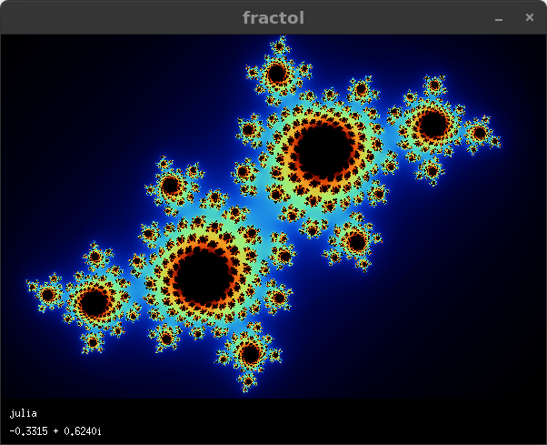
  </a>
  <a href="images/color2.png">
    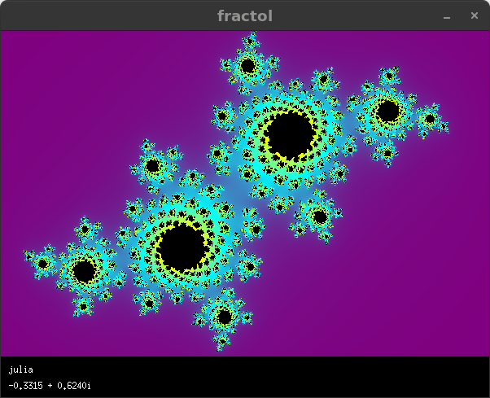
  </a>
</div>

<div align="center">
  <a href="images/color3.png">
    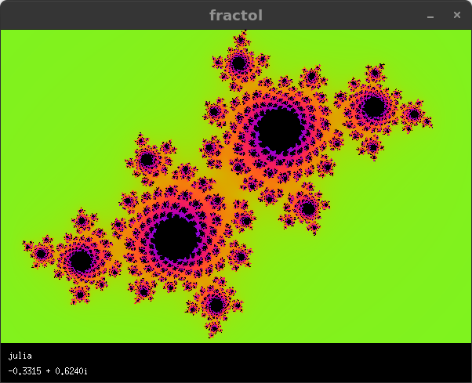
  </a>
  <a href="images/color4.png">
    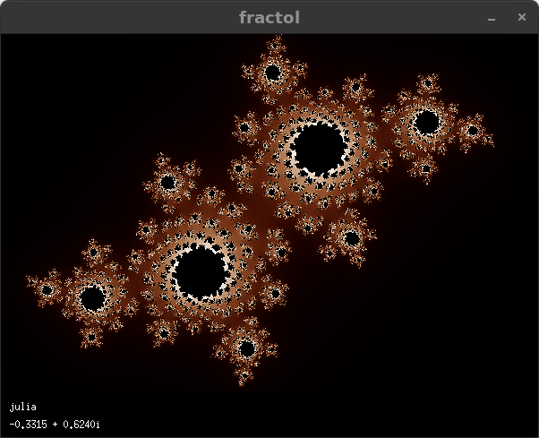
  </a>
</div>

### Fractal Examples

Below are examples of fractals in their different versions (Mandelbrot and Julia, when applicable), displayed in pairs:

- **Mandelbrot:**

<div align="center">
  <a href="images/mandelbrot_full.png">
    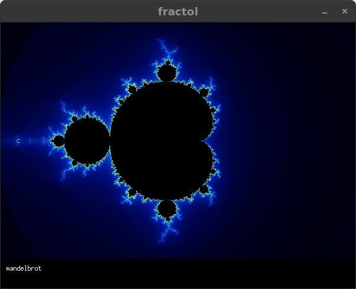
  </a>
  <a href="images/mandelbrot_detail.png">
    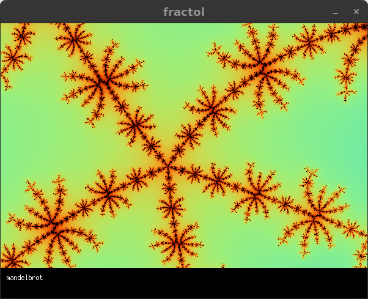
  </a>
</div>

- **Julia:**

<div align="center">
  <a href="images/julia_sample1.png">
    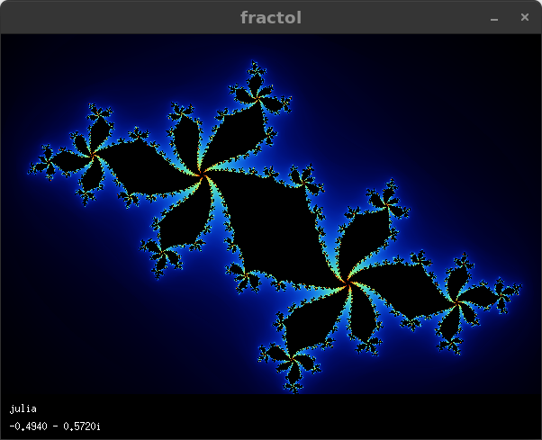
  </a>
  <a href="images/julia_sample2.png">
    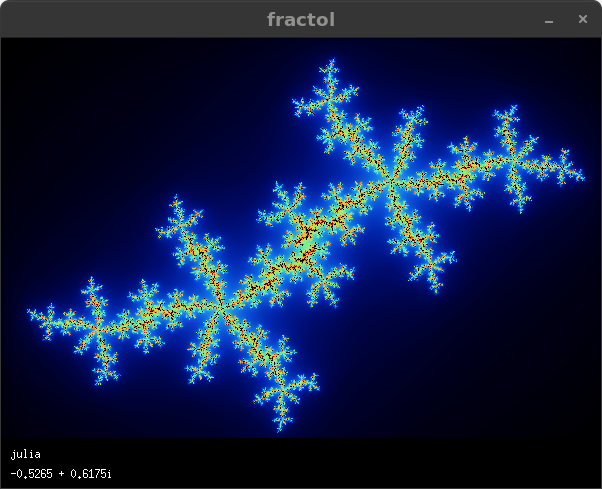
  </a>
</div>

- **Burning Ship:**

<div align="center">
  <a href="images/burning_ship_mandelbrot.png">
    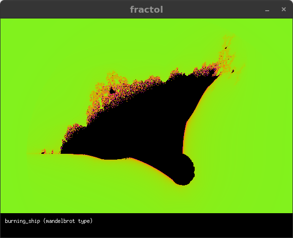
  </a>
  <a href="images/burning_ship_julia.png">
    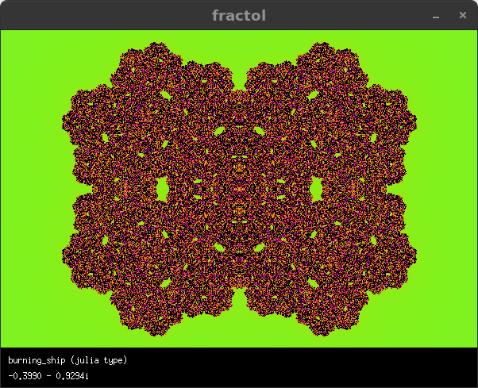
  </a>
</div>

- **Multibrot:**

<div align="center">
  <a href="images/multibrot_mandelbrot.png">
    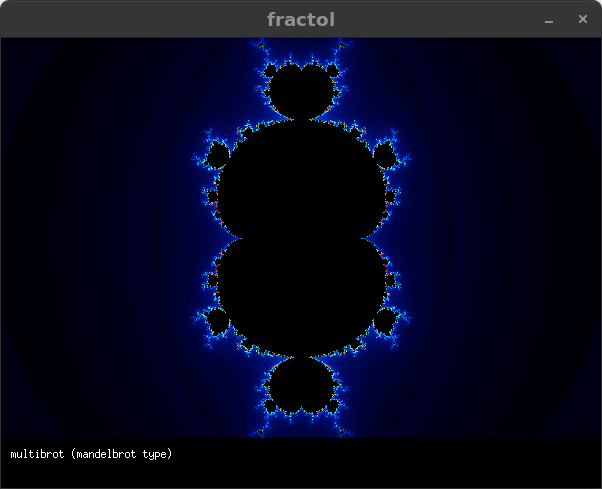
  </a>
  <a href="images/multibrot_julia.png">
    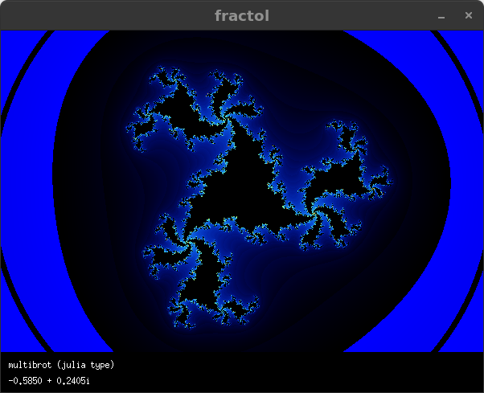
  </a>
</div>

- **Tricorn:**

<div align="center">
  <a href="images/tricorn_mandelbrot.png">
    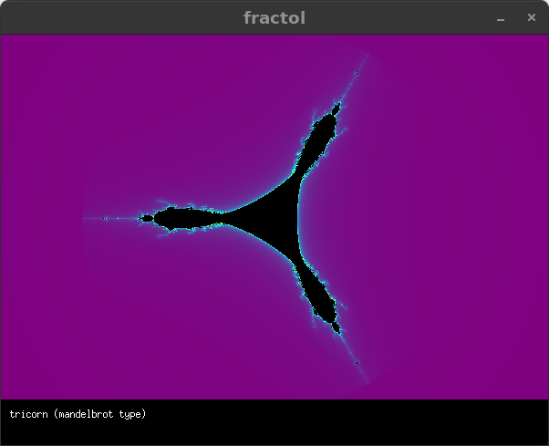
  </a>
  <a href="images/tricorn_julia.png">
    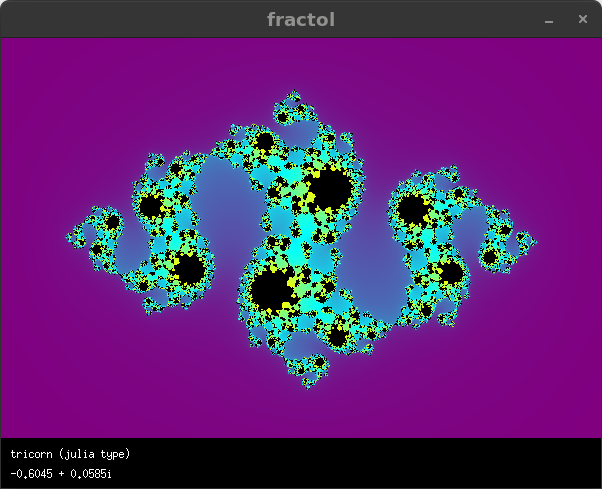
  </a>
</div>

- **Celtic:**

<div align="center">
  <a href="images/celtic_mandelbrot.png">
    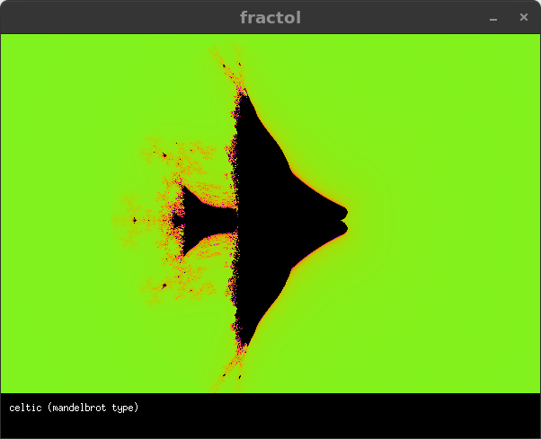
  </a>
  <a href="images/celtic_julia.png">
    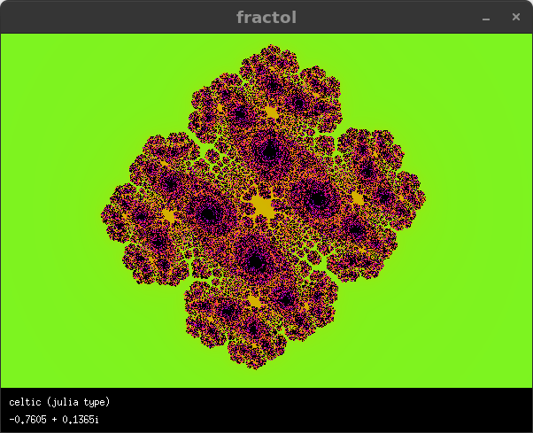
  </a>
</div>

- **Buffalo:**

<div align="center">
  <a href="images/buffalo_mandelbrot.png">
    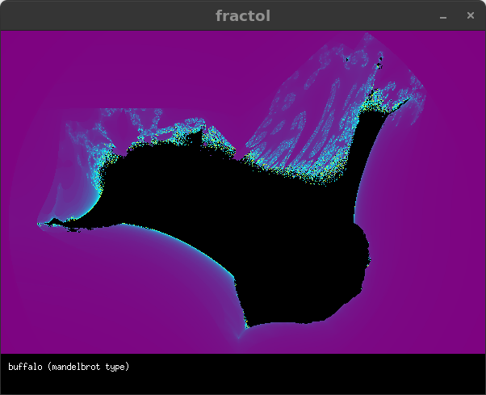
  </a>
  <a href="images/buffalo_julia.png">
    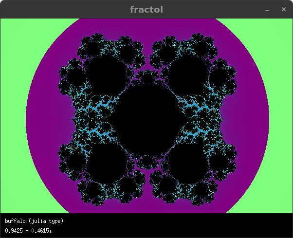
  </a>
</div>

---

## 4. Math and Fractal Theory

Fractals are objects that exhibit self-similarity and infinite complexity. Mathematically, they can be defined by iterating complex functions.

### Mandelbrot Set

The **Mandelbrot set** is defined as the set of points $c \in \mathbb{C}$ for which the sequence

$$
z_{n+1} = z_n^2 + c \quad\text{with}\; z_0 = 0
$$

remains bounded, i.e.:

$$
\limsup_{n \to \infty} |z_n| < \infty.
$$

Its boundary is famous for its infinitely rich structure.

### Julia Set

For a fixed parameter $c$, the **Julia set** is defined as:

$$
J(c) = \{ z_0 \in \mathbb{C} \mid \{z_{n+1} = z_n^2 + c\}\text{ does not diverge} \}.
$$

A key property is:

- If $c$ belongs to the Mandelbrot set, then $J(c)$ is connected.  
- If $c$ does not belong to the Mandelbrot set, $J(c)$ is disconnected (often called "Julia dust").

### Calculation Algorithm

Fractal rendering is based on the **escape time algorithm**:

1. **Pixel mapping to the complex plane:**  
   Each pixel $(x,y)$ is transformed into a complex number $z_0$ or used as $c$, depending on the fractal.

2. **Iteration:**  
   Recursively apply $f(z) = z^2 + c$ (or its variants for other fractals).

3. **Escape condition:**  
   Count the number of iterations $n$ until $|z_n|$ exceeds a threshold (e.g., 2). If $n$ reaches the maximum defined value, the point is assumed to be within the fractal.

4. **Color smoothing:**  
   A smoothing function is used to assign a continuous iteration value and achieve smoother color gradients.

Other fractals (such as *burning_ship*, *multibrot*, *tricorn*, *celtic*, and *buffalo*) modify the iterative function and/or the mapping to the complex plane, resulting in unique patterns and symmetries.

This implementation is ideal for students and enthusiasts of complex analysis, as it brings together concepts from analysis, geometry, and chaos theory in an interactive, visually striking tool.

---

## 5. Project Structure

The project is organized as follows:

- **src/**
  - `main.c`  
    Entry point for the mandatory version. Initializes the application and handles the event loop.
  - `hooks.c`  
    Handles keyboard and mouse events for the mandatory version.
  - `parser.c`  
    Processes command-line arguments and selects the fractal type.
  - `draw.c`  
    Renders the fractal in the window, performing iterations and assigning colors.
  - `math.c`  
    Implements the math calculations for the *julia* and *mandelbrot* fractals.

- **bonus/**
  - `main_bonus.c`  
    Entry point for the bonus version, featuring additional fractals and extended options.
  - `hooks_bonus.c`  
    Handles interaction in the bonus version.
  - `parser_bonus.c`  
    Processes arguments for the bonus mode.
  - `draw_bonus.c`  
    Renders fractals in the bonus version.
  - `math_bonus.c`, `math2_bonus.c`  
    Contain specific functions for calculating fractals like *burning_ship*, *multibrot*, *tricorn*, *celtic*, and *buffalo*.
  - `info_bonus.c`  
    Displays on-screen information (like an info panel).
  - `color_bonus.c`  
    Defines the color schemes for the bonus version.

- **include/**  
  Header files (`.h`) containing definitions and prototypes used in the project.

- **libft/**  
  A library of helper functions developed following 42 standards.

- **minilibx/**  
  The graphical library used for window creation and graphics handling.

- **images/**  
  A directory containing snapshots and visual examples of different fractals and color palettes.

- **Makefile**  
  Defines the compilation rules for both the **mandatory** and **bonus** versions.

---

Explore, experiment, and be amazed by the infinite beauty of fractals!  
If you find any problems, have suggestions, or want to collaborate, feel free to open an *issue* or submit a *pull request* in the repository:

[github.com/cesardelarosa/fract-ol](https://github.com/cesardelarosa/fract-ol)

---

## Credits

- **Author:** César de la Rosa (cde-la-r)  
- **Email:** code@cesardelarosa.xyz  
- **Project:** Fract-ol (Project for the 42 programming curriculum)

---

*Enjoy exploring these infinite visual and mathematical universes!*
